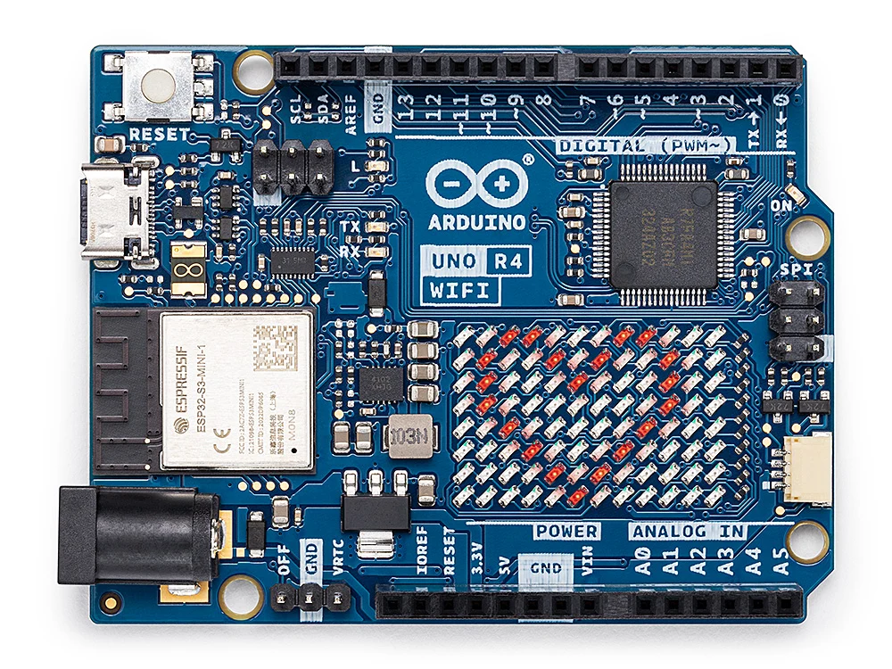

# Juno: Java for Arduino

Juno is an experimental ahead-of-time compiler for running a practical subset of Java on the
Arduino UNO R4 WiFi and UNO R4 Minima. It keeps `javac` as the Java frontend, performs
closed-world linking on the development machine, and emits an Arduino C++ sketch which the
Renesas toolchain compiles to native Cortex-M4 code.



This repository contains a working v0.1 compiler, not a JVM interpreter. The first milestone
supports 32-bit integer code, static methods, branches, loops, and GPIO/time intrinsics. It can
compile [`examples/Blink.java`](examples/Blink.java) all the way to a `.ino` sketch.

```text
Java source -> javac -> .class -> Juno linker/AOT -> .ino -> Arduino toolchain -> RA4M1
```

## Quick start

Requirements: JDK 25+ and Maven 3.9+.

### Install Arduino CLI on macOS

Install Arduino CLI with Homebrew and confirm that it is available:

```bash
brew update
brew install arduino-cli
arduino-cli version
```

Then update the board index and install the UNO R4 toolchain:

```bash
arduino-cli core update-index
arduino-cli core install arduino:renesas_uno
arduino-cli core list
```

Connect the board and find its serial port:

```bash
arduino-cli board list
```

The port usually looks like `/dev/cu.usbmodem...` on macOS. Keep that value for the upload step.

### Build the Juno compiler and example

```bash
./mvnw clean package

mkdir -p build/example-classes
javac --release 17 \
  -cp target/juno-0.1.0-SNAPSHOT.jar \
  -d build/example-classes \
  examples/Blink.java

java -jar target/juno-0.1.0-SNAPSHOT.jar compile \
  --main Blink \
  --classpath build/example-classes
```

The generated sketch is `build/juno/Blink/Blink.ino`. Compile and upload it with:

```bash
arduino-cli board list
arduino-cli compile --fqbn arduino:renesas_uno:unor4wifi build/juno/Blink
arduino-cli upload \
  --port /dev/cu.usbmodemACA704344CE82 \
  --fqbn arduino:renesas_uno:unor4wifi \
  build/juno/Blink
```

Replace `/dev/cu.YOUR_PORT` with the port reported by `arduino-cli board list`. Use
`arduino:renesas_uno:minima` instead of `arduino:renesas_uno:unor4wifi` for the UNO R4 Minima.

## Java API

Hardware operations are normal Java native declarations at compile time and compiler intrinsics
at link time:

```java
import io.github.jabrena.juno.api.Delay;
import io.github.jabrena.juno.api.DigitalOutput;

public final class Blink {
    public static void main(String[] args) {
        DigitalOutput led = DigitalOutput.of(13);
        while (true) {
            led.toggle();
            Delay.millis(500);
        }
    }
}
```

Available v0.1 intrinsics are:

- `Gpio.pinMode`, `digitalWrite`, `digitalRead`, `analogRead`, `analogWrite`, and `toggle`
- zero-allocation `DigitalOutput.of`, `high`, `low`, `toggle`, and `isHigh`
- `Delay.millis` and `Delay.micros`
- `Clock.millis` and `Clock.micros`
- `LedMatrix.begin`, `loadFrame`, and `clear` for the UNO R4 WiFi's built-in 12x8 LED matrix
  (see [`examples/LedMatrixHeart.java`](examples/LedMatrixHeart.java) and the self-playing
  [`examples/LedMatrixSnake.java`](examples/LedMatrixSnake.java)); each frame is 96 pixels
  packed MSB-first into three 32-bit words, matching `Arduino_LED_Matrix::loadFrame(const uint32_t[3])`

On top of the intrinsics, `io.github.jabrena.juno.api` also has plain (non-intrinsic) Java helpers
for the LED matrix, since Juno v0.1 has no arrays to hold a font table:

- `LedCanvas` — pixel/frame-word addressing (`setPixel`, `inBounds`, `packPos`) shared by every
  LED matrix example
- `LedMatrixFont` — a classic 5x7 dot-matrix font for digits (`digitPixel`) and uppercase letters
  (`letterPixel`), encoded as small per-glyph functions instead of an array
- `LedMatrixText` — `drawDigit`/`drawLetter`, which OR a glyph into a frame word at a given origin;
  two glyphs fit side by side (5 + 1 gap + 5 = 11 of the 12 columns)

Because linking is closed-world, a program that only calls `drawDigit` never pulls the 26-letter
table into flash — see [`examples/LedMatrixCountUp.java`](examples/LedMatrixCountUp.java), which
counts 1 to 10 on the matrix.

## Supported Java subset

Juno deliberately fails at link time when reachable code uses something outside the current
subset. Diagnostics identify the method, bytecode offset, and unsupported opcode.

Supported today:

- `static void main(String[])` and the embedded-friendly `static void main()`
- static methods with `boolean`, `byte`, `char`, `short`, and `int` arguments/results
- local variables, integer constants, arithmetic, bitwise operations, shifts, comparisons,
  conditionals, and loops
- direct static calls with closed-world reachability; unused methods are omitted
- opaque `DigitalOutput` handles which compile down to integer pin numbers without heap allocation
- Java-compatible 32-bit wrapping arithmetic and divide-overflow behavior
- `.class` inputs from directories, individual files, or JARs

Not yet supported:

- general objects, constructors, instance/virtual/interface calls, or arrays used by application code
- static fields, strings, exceptions, garbage collection, threads, reflection, or dynamic loading
- `long`, `float`, and `double`
- the desktop JDK class library

The `String[]` parameter of a conventional `main` is accepted as an entrypoint convention, but
there are no command-line arguments on the board and it must not be accessed.

## Architecture

- `classfile` parses standard JVM class files and resolves constant-pool references.
- `bytecode` decodes and validates the v0.1 instruction set.
- `linker` starts at `main`, follows reachable static calls, resolves hardware intrinsics, and
  eliminates unreachable methods.
- `backend` emits standalone Arduino C++ with compact operand/local stacks. The native compiler
  can then optimize those fixed-size structures.
- `api` provides the small Java-facing hardware abstraction.

Juno currently uses ArduinoCore-renesas as its HAL. Moving selected intrinsics to Renesas FSP or
direct registers, then adding an SSA IR before C emission, are natural later steps.

## Development

```bash
mvn test
```

The tests compile Java fixtures, check reachability and failure diagnostics, and pass generated
C++ through `clang++` or `g++` with a minimal Arduino compatibility header when one is available.

## References

- https://store.arduino.cc/products/uno-r4-wifi