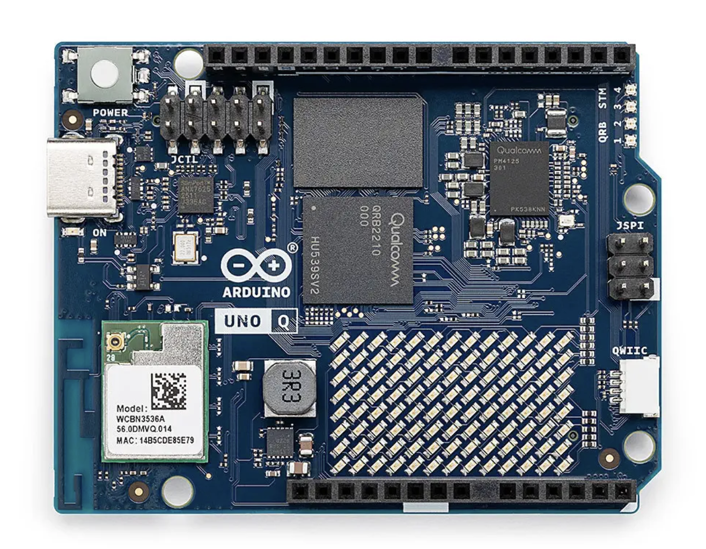
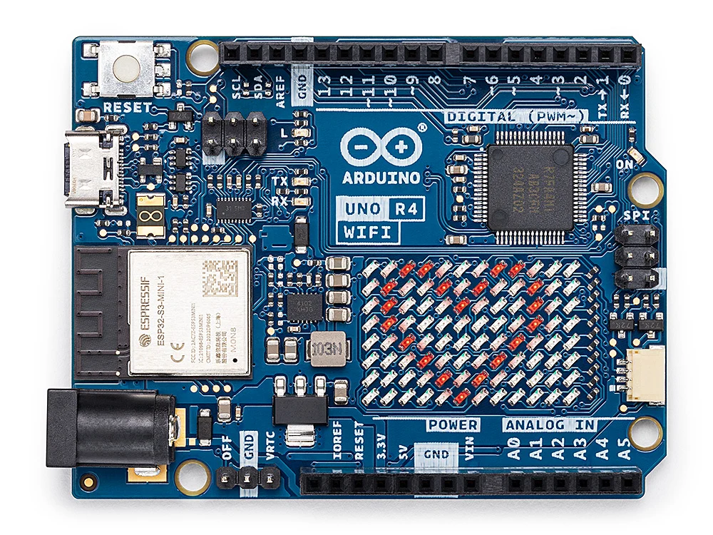

# Juno: Java for Arduino One

Juno is an ahead-of-time compiler for running a practical subset of Java on the Arduino UNO R4 WiFi
and the Arduino UNO Q. It keeps `javac` as the Java frontend, performs
closed-world linking on the development machine, and emits GNU ARM (Cortex-M4, Thumb-2) assembly.

[](https://github.com/jabrena/juno/actions/workflows/maven.yaml)

**Arduino UNO Q**



**Arduino UNO R4 WiFi**



## Modules

This is a multi-module Maven build:

- [`juno-api/`](juno-api) — the programming model: the Java-facing hardware API the compiler
  recognizes as intrinsics (`api/`) and the `@Board` annotations used to select a compilation
  target (`annotations/`). This is the only artifact programs compile against.
- [`juno-compiler/`](juno-compiler) — the compiler (`classfile`, `bytecode`, `linker`, `backend`, …),
  which depends on `juno-api`. Builds the executable `juno-compiler/target/juno-compiler-<version>.jar`.
- [`juno-maven-plugin/`](juno-maven-plugin) — Maven goals for generating a sketch (`juno:compile`),
  compiling it with Arduino CLI (`juno:verify`), uploading it (`juno:upload`), and opening the
  serial monitor (`juno:monitor`).
- [`juno-examples/`](juno-examples) — example Java programs written against `juno-api`, built
  like any other Maven module so they're checked for compile errors on every build.
- [`juno-site/`](juno-site) — the [Roq](https://iamroq.dev)/Quarkus static site generator behind
  the [documentation site](https://jabrena.github.io/juno/). `docs/` is entirely generated from
  Markdown under `juno-site/src/main/resources/content/` — see
  [Documentation site](#documentation-site) below to regenerate it.

## Quick start

Requirements: JDK 27+ and Maven 3.9+.

```bash
./mvnw clean install
```

### Blink

[`Blink`](juno-examples/src/main/java/io/github/jabrena/juno/api/Blink.java) runs on either board
unmodified: expect the UNO R4 WiFi's built-in LED, or the UNO Q's red status LED, to alternate on
and off every 500 ms (one full cycle per second).

```java
package io.github.jabrena.juno.api;

import io.github.jabrena.juno.api.io.DigitalOutput;
import io.github.jabrena.juno.api.io.Gpio;

public final class Blink {

    public static void main(String[] args) {

        DigitalOutput led = DigitalOutput.of(Gpio.builtinLed());

        while (true) {
            led.high();
            Delay.millis(500);

            led.low();
            Delay.millis(500);
        }
    }
}
```

The project provides a `Maven plugin` to help the user with the common operations. `juno:upload` generates the sketch, verifies it with `arduino-cli`, and flashes it in one step.
`Blink` targets both boards, so pick one with `-Djuno.board`:

```bash
./mvnw -f juno-examples/pom.xml compile juno:upload \
  -Djuno.main=io.github.jabrena.juno.api.Blink \
  -Djuno.board=arduino-uno-q

./mvnw -f juno-examples/pom.xml compile juno:upload \
  -Djuno.main=io.github.jabrena.juno.api.Blink \
  -Djuno.board=arduino-uno-r4-wifi
```

It auto-detects the port when exactly one matching board is connected. Otherwise, select it with
`-Djuno.port=<PORT>`. Select another example with `-Djuno.main=<fully-qualified-class-name>`.

## Supported Java subset

Juno is an ahead-of-time compiler, not a JVM, so it intentionally supports a focused, predictable
subset of Java that can be translated into native code for resource-constrained Arduino boards.
Programs are first compiled normally with `javac`; Juno then performs closed-world linking from
`main`, follows every reachable method, and validates the bytecode before generating the sketch.

Valid Java is therefore not automatically valid Juno input. If reachable code needs an unsupported
bytecode instruction, JDK feature, or `invokedynamic` bootstrap, compilation stops instead of
emitting code with uncertain behavior. The diagnostic identifies the method, bytecode offset, and
unsupported operation or bootstrap. The currently supported Java subset includes:

- **Entrypoints and methods:** `static void main(String[])`, the embedded-friendly
  `static void main()`, static methods with primitive arguments and results, direct closed-world
  calls, and removal of unreachable methods. See
  [`HelloWorld`](juno-examples/src/main/java/io/github/jabrena/juno/HelloWorld.java) and
  [`Methods`](juno-examples/src/main/java/io/github/jabrena/juno/Methods.java).
- **Primitive types:** `boolean`, `byte`, `short`, `char`, `int`, `long`, `float`, and `double`.
  The example prints each type's size and range using `javac`-folded `BYTES`, `MIN_VALUE`, and
  `MAX_VALUE` constants. See
  [`PrimitiveTypes`](juno-examples/src/main/java/io/github/jabrena/juno/PrimitiveTypes.java).
- **Values and control flow:** constants, mutable static fields, local variables, arithmetic,
  bitwise and shift operations, comparisons, conditionals, `switch`, and loops. See
  [`Variables`](juno-examples/src/main/java/io/github/jabrena/juno/Variables.java),
  [`Operators`](juno-examples/src/main/java/io/github/jabrena/juno/Operators.java), and
  [`ControlFlow`](juno-examples/src/main/java/io/github/jabrena/juno/ControlFlow.java).
- **Arrays:** fixed-size primitive arrays (`boolean` through `double`, including fixed-size
  multidimensional arrays) allocated from the fixed 8 KiB arena, and `static final` read-only lookup
  tables with an all-constant initializer, kept in flash instead of RAM. See
  [`Arrays`](juno-examples/src/main/java/io/github/jabrena/juno/Arrays.java).
- **Strings:** string literals, `String.valueOf(int)`, `length()`, and `charAt(int)` for runtime
  string references, `equals`, plus `+` concatenation of strings and a `StringBuilder`. See
  [`Strings`](juno-examples/src/main/java/io/github/jabrena/juno/Strings.java).
- **BigInteger and BigDecimal:** arbitrary-precision `java.math.BigInteger` and `BigDecimal`, with
  `MathContext` and the `RoundingMode` constants. Arithmetic, `pow`, `sqrt`, division by scale,
  `RoundingMode` or `MathContext`, `setScale`, `round`, comparisons, conversions and `toString` /
  `toPlainString` follow the JDK's results, scales and rounding. Values are immutable blocks in the
  8 KiB arena and are garbage-collected, so precision is limited by memory, not by a fixed width. See
  [`ScopedValuesPrecision`](juno-examples/src/main/java/io/github/jabrena/juno/ScopedValuesPrecision.java).
- **Objects:** simple enums, records, final closed-world classes, constructors, and instance fields.
  Objects, records, and capturing closures share the fixed 8 KiB arena, which uses conservative
  garbage collection. See
  [`Objects`](juno-examples/src/main/java/io/github/jabrena/juno/Objects.java).
- **Interfaces:** directly implemented interfaces with closed-world dispatch through an interface
  reference. See
  [`Interfaces`](juno-examples/src/main/java/io/github/jabrena/juno/Interfaces.java).
- **Lambdas and method references:** non-capturing and capturing lambdas, plus static, bound,
  unbound, and constructor references emitted through `LambdaMetafactory.metafactory`. See
  [`Lambdas`](juno-examples/src/main/java/io/github/jabrena/juno/Lambdas.java).
- **Math and random numbers:** the documented `java.lang.Math` subset and Arduino-backed bounded
  pseudorandom numbers. See
  [`MathFunctions`](juno-examples/src/main/java/io/github/jabrena/juno/MathFunctions.java) and
  [`RandomNumbers`](juno-examples/src/main/java/io/github/jabrena/juno/RandomNumbers.java).
- **Exceptions:** `throw`, `try`/`catch` (including multi-catch and catching by a supertype),
  `finally`, nested handlers, propagation between methods, custom final exception classes, and
  try-with-resources. See
  [`Exceptions`](juno-examples/src/main/java/io/github/jabrena/juno/Exceptions.java).
- **Concurrency:** the supported JDK 27 preview `StructuredTaskScope` subset (up to four threads
  including `main`, with `Thread.sleep` and `Thread.yield` inside subtasks), restricted monitors and
  `ReentrantLock`, and `ScopedValue` bindings inherited by forked subtasks. `java.lang.Thread` itself is
  rejected at compile time; `AtomicInteger`, `AtomicBoolean` and `AtomicLong` are available. See
  [`Synchronization`](juno-examples/src/main/java/io/github/jabrena/juno/Synchronization.java),
  [`StructuredConcurrency`](juno-examples/src/main/java/io/github/jabrena/juno/StructuredConcurrency.java), and
  [`ScopedValuesPrecision`](juno-examples/src/main/java/io/github/jabrena/juno/ScopedValuesPrecision.java)
  (a scoped `MathContext` shared by three parallel subtasks).
- **Board services:** GPIO, clocks and delays, serial I/O, LED matrices, mouse input, Wi-Fi,
  HTTP/HTTPS, bounded JSON inspection, and read-only SPI SD-card files through Juno's intrinsic APIs.
  See [`Blink`](juno-examples/src/main/java/io/github/jabrena/juno/api/Blink.java) (GPIO and delays),
  [`SerialCounter`](juno-examples/src/main/java/io/github/jabrena/juno/api/io/serial/SerialCounter.java) (serial I/O),
  [`HttpServerStatus`](juno-examples/src/main/java/io/github/jabrena/juno/api/net/http/HttpServerStatus.java) (clocks),
  [`LedMatrixHeart`](juno-examples/src/main/java/io/github/jabrena/juno/api/led/LedMatrixHeart.java) (LED matrix),
  [`WifiStatus`](juno-examples/src/main/java/io/github/jabrena/juno/api/net/WifiStatus.java) (Wi-Fi),
  [`WifiStatusSD`](juno-examples/src/main/java/io/github/jabrena/juno/api/net/WifiStatusSD.java) (Wi-Fi credentials loaded from an SD card),
  [`WifiStatusSDLcd`](juno-examples/src/main/java/io/github/jabrena/juno/api/net/WifiStatusSDLcd.java) (the same, with an LCD Keypad Shield),
  [`WifiProvisioning`](juno-examples/src/main/java/io/github/jabrena/juno/api/net/http/WifiProvisioning.java) (access point and HTTP server to provide Wi-Fi credentials),
  [`HttpsMethods`](juno-examples/src/main/java/io/github/jabrena/juno/api/net/http/HttpsMethods.java) (HTTP/HTTPS and JSON), and
  [`SdFileOperations`](juno-examples/src/main/java/io/github/jabrena/juno/api/io/SdFileOperations.java) (SD card).
- **Shields:** stacked shields are driven through the same intrinsic APIs.
  The [LCD Keypad Shield](https://jabrena.github.io/juno/lcd-keypad-shield) (16x2 display, buttons,
  backlight) is shown in
  [`LcdKeypadDemo`](juno-examples/src/main/java/io/github/jabrena/juno/api/lcd/LcdKeypadDemo.java).
  The [ELEGOO 2.8" TFT touch shield](https://jabrena.github.io/juno/tft-touch-shield) (display,
  touch, microSD) is shown in
  [`TouchPaintTFT`](juno-examples/src/main/java/io/github/jabrena/juno/api/tft/TouchPaintTFT.java) and
  [`WifiStatusTFT`](juno-examples/src/main/java/io/github/jabrena/juno/api/net/WifiStatusTFT.java).
  The [AZDelivery Data Logger Module Data Recorder Shield](https://jabrena.github.io/juno/storage)
  provides the SD card for
  [`WifiStatusSD`](juno-examples/src/main/java/io/github/jabrena/juno/api/net/WifiStatusSD.java).
- **Compile-time safety checks:** deterministic closed-world linking and runtime-risk warnings for
  loop allocations, arena pressure, recursion, unchecked array access, possible division by zero,
  and proven-null dereferences.

For example,
[`UnsupportedFeature`](juno-examples/src/main/java/io/github/jabrena/juno/UnsupportedFeature.java)
compiles with plain `javac`, but it deliberately fails `juno:compile`: its generated record
`toString()` uses the unsupported `ObjectMethods` bootstrap.

```bash
# Expected to fail with an unsupported-bootstrap diagnostic
./mvnw -f juno-examples/pom.xml compile juno:compile \
  -Djuno.main=io.github.jabrena.juno.UnsupportedFeature
```

Compile any supported example by passing its fully qualified class name. These examples all come
from the `io.github.jabrena.juno` package. Examples whose `@Board` lists both boards need
`-Djuno.board`:

```bash
# Entrypoints and methods
./mvnw -f juno-examples/pom.xml compile juno:compile \
  -Djuno.main=io.github.jabrena.juno.HelloWorld

./mvnw -f juno-examples/pom.xml compile juno:compile \
  -Djuno.main=io.github.jabrena.juno.Methods

# Values and control flow
./mvnw -f juno-examples/pom.xml compile juno:compile \
  -Djuno.main=io.github.jabrena.juno.Variables

./mvnw -f juno-examples/pom.xml compile juno:compile \
  -Djuno.main=io.github.jabrena.juno.PrimitiveTypes

./mvnw -f juno-examples/pom.xml compile juno:compile \
  -Djuno.main=io.github.jabrena.juno.Operators

./mvnw -f juno-examples/pom.xml compile juno:compile \
  -Djuno.main=io.github.jabrena.juno.ControlFlow

# Arrays
./mvnw -f juno-examples/pom.xml compile juno:compile \
  -Djuno.main=io.github.jabrena.juno.Arrays

# Objects and interfaces
./mvnw -f juno-examples/pom.xml compile juno:compile \
  -Djuno.main=io.github.jabrena.juno.Objects

./mvnw -f juno-examples/pom.xml compile juno:compile \
  -Djuno.main=io.github.jabrena.juno.Interfaces \
  -Djuno.board=arduino-uno-r4-wifi

# Lambdas and method references
./mvnw -f juno-examples/pom.xml compile juno:compile \
  -Djuno.main=io.github.jabrena.juno.Lambdas \
  -Djuno.board=arduino-uno-r4-wifi

# Math and random numbers
./mvnw -f juno-examples/pom.xml compile juno:compile \
  -Djuno.main=io.github.jabrena.juno.MathFunctions

./mvnw -f juno-examples/pom.xml compile juno:compile \
  -Djuno.main=io.github.jabrena.juno.RandomNumbers

# Exceptions
./mvnw -f juno-examples/pom.xml compile juno:compile \
  -Djuno.main=io.github.jabrena.juno.Exceptions

# Concurrency
./mvnw -f juno-examples/pom.xml compile juno:compile \
  -Djuno.main=io.github.jabrena.juno.Synchronization \
  -Djuno.board=arduino-uno-r4-wifi

./mvnw -f juno-examples/pom.xml compile juno:compile \
  -Djuno.main=io.github.jabrena.juno.StructuredConcurrency \
  -Djuno.board=arduino-uno-r4-wifi

./mvnw -f juno-examples/pom.xml compile juno:compile \
  -Djuno.main=io.github.jabrena.juno.ScopedValuesPrecision \
  -Djuno.board=arduino-uno-r4-wifi
```

Examples in subpackages use the same command. A board-specific program can also select its target
explicitly:

```bash
./mvnw -f juno-examples/pom.xml compile juno:compile \
  -Djuno.main=io.github.jabrena.juno.games.chess.Chess \
  -Djuno.board=arduino-uno-r4-wifi
```

## Architecture

Juno is an ahead-of-time compiler, not a virtual machine. An Arduino board has no JVM, so nothing is
interpreted at run time: the Java program is compiled with `javac` as usual, and Juno then translates the
resulting JVM bytecode into native ARM assembly that the Arduino toolchain builds into the sketch's firmware.
The compiler is *closed-world*: it only sees the classes reachable from `main`, so it can resolve every call
at build time, drop everything unused, and reject anything outside the supported subset before generating a
single instruction. That is also why there is no dynamic class loading, reflection, or general heap.

### From Java to a running board

```text
 Hello.java ──javac──▶ Hello.class ──▶ Juno ──▶ Hello.S + HelloShim.cpp + HelloAsm.ino ──arduino-cli──▶ board
                                       │
                 classfile → bytecode → linker → lowering → optimize → backend
```

1. **Write the program** against the Java-facing hardware API (`Serial`, `Gpio`, `Delay`, …, in
   `io.github.jabrena.juno.api`) and, if it should run on a specific board, annotate the entry point with
   `@Board`. The entry point is a `static void main(String[])` (or `main()`).
2. **Compile with `javac`.** Maven does this for you (`compile`). The result is ordinary `.class` files, which are
   the only input Juno reads; the Java sources are never parsed.
3. **Read the classes.** `classfile` parses the `.class` files and resolves their constant pools, and
   `bytecode` decodes each method into the admitted instruction subset.
4. **Link, closed-world.** `linker` starts at `main` and follows every statically resolvable call. Calls into
   the hardware API become *intrinsics*, methods nothing reaches are discarded, and the board from `@Board`
   is resolved. Anything reachable that falls outside the subset (an unsupported opcode, an unsupported
   `invokedynamic` bootstrap, a type Juno does not model) stops the build with a diagnostic naming the method,
   the bytecode offset, and the operation, rather than emitting code with uncertain behavior.
5. **Lower to IR.** `lowering` turns each reachable method into Juno's own block-structured intermediate
   representation (`ir`), making every operand-stack slot and local variable an explicit, typed value.
   Lambdas, string concatenation, enums, records, exceptions, and structured tasks are given their Juno-specific
   meaning here.
6. **Optimize.** `optimize` runs IR passes: small leaf methods (getters, setters, constructors, little math
   helpers) are inlined; an object that never leaves its method is scalar-replaced, its fields kept in locals
   instead of the arena; local copies and constants are propagated across the control-flow graph and folded;
   branches with a constant condition, dead blocks, unused values and stores nothing reads are removed; and a
   range analysis drops every array bounds check it proves can never fail. The backend folds constants into
   Thumb-2 immediate operands and tests a comparison that feeds a branch directly. `analysis` then inspects
   the result and reports runtime risks at build time: arena budget versus estimated use, static RAM, call
   depth, allocation inside loops, recursion, possible division by zero, unchecked array access, and
   proven-null dereferences.
7. **Generate code.** `backend` emits GNU ARM Cortex-M4 (Thumb-2) assembly directly from the IR, plus a small
   `extern "C"` C++ runtime shim (GPIO, Serial, LED matrix, Wi-Fi, HTTP, JSON, strings, the arena allocator and
   its garbage collector, `long`/`float`/`double` support, exception and structured-task support) that the assembly calls
   into. Most optional helpers and Arduino headers (Mouse, Wi-Fi, HTTP, JSON, strings, …) are included only when the
   program uses them, and the output is deterministic: the same classes always produce the same bytes. Per-core differences (UNO R4 WiFi's Renesas
   core versus UNO Q's Zephyr core) live in a `CoreRuntime`, never in a branch on a specific board.
8. **Wrap it as a sketch.** The Maven plugin writes the `.S`, the `Shim.cpp`, and a tiny `.ino` whose `setup()`
   calls the generated entry point and whose `loop()` is empty, under `target/juno/<Main>Asm/`.
9. **Build and flash with the Arduino toolchain.** `arduino-cli compile --fqbn <board>` assembles and links the
   sketch against the board's core, and `arduino-cli upload` flashes it. The plugin drives both, so
   `juno:verify` stops after the compile (no board needed), `juno:upload` also flashes it, and `juno:monitor`
   opens the serial monitor.

In practice, steps 2 to 9 are one command per goal (`juno-examples/pom.xml` supplies `Blink` as the default
entry point; select another with `-Djuno.main=<class>`):

```bash
./mvnw -f juno-examples/pom.xml compile juno:compile   # javac + Juno: generate the sketch only
./mvnw -f juno-examples/pom.xml compile juno:verify    # ... and build it with arduino-cli (no board needed)
./mvnw -f juno-examples/pom.xml compile juno:upload    # ... and flash the connected board
./mvnw -f juno-examples/pom.xml juno:monitor           # attach the serial monitor
```

### Modules and packages

- `classfile` parses standard JVM class files and resolves constant-pool references.
- `bytecode` decodes and validates the v0.1 instruction set.
- `linker` starts at `main`, follows reachable static calls, resolves hardware intrinsics, and
  eliminates unreachable methods.
- `lowering`, `ir`, and `optimize` translate the reachable bytecode into Juno's IR and simplify it;
  `analysis` builds the control-flow graph and produces the build-time runtime-risk report.
- `backend` emits GNU ARM (Cortex-M4, Thumb-2) assembly directly from Juno's IR, plus a small
  `extern "C"` C++ runtime shim (GPIO/Serial/LED matrix/Wi-Fi/HTTP/JSON helpers, the arena
  allocator, `long`/`float`/`double` support) that the generated assembly calls into.
- `juno-maven-plugin` wraps the compiler and the Arduino CLI as the `juno:compile`, `juno:verify`,
  `juno:upload`, and `juno:monitor` goals.

The compiler stages live under
[`juno-compiler/src/main/java/io/github/jabrena/juno/`](juno-compiler/src/main/java/io/github/jabrena/juno);
the small Java-facing hardware abstraction (`api/`) and the `@Board` selection types (`annotations/`)
live under [`juno-api/src/main/java/io/github/jabrena/juno/`](juno-api/src/main/java/io/github/jabrena/juno).

## Development

All commands use the Maven wrapper (`./mvnw`) from the repository root, with the JDK pinned in `.sdkmanrc`.

### Build and test

```bash
./mvnw clean test      # unit tests, including the offline assembly/shim toolchain checks
./mvnw clean verify    # what CI runs: tests, static analysis, and packaging
```

### Run generated code on a toolchain

Both profiles live in the `juno-compiler` module, need Docker and are opt-in, because they start containers.

```bash
# Compile the small API and shield fixtures for each board with the real arduino-cli (does not touch hardware)
./mvnw -pl juno-compiler -am -Parduino-cli verify

# Run the core-feature programs under QEMU (Cortex-M4) and compare their serial output with OpenJDK's
./mvnw -pl juno-compiler -am -Pqemu verify
```

### Code quality

The `cyclomatic-complexity` profile is active by default, so a plain `verify` already enforces it;
naming it explicitly just makes that visible.

```bash
./mvnw clean verify -Pcyclomatic-complexity               # fail the build on over-complex methods (PMD)
./mvnw -Pcyclomatic-complexity -DskipTests site           # generate the complexity report
jwebserver -d "$(pwd)/target/site" -p 8000                # then open http://127.0.0.1:8000/
```

### Documentation

The published site lives in `docs/` and is generated from `juno-site/src/main/resources/content/`;
never edit `docs/` by hand.

```bash
./mvnw javadoc:aggregate                                  # API docs into docs/javadocs/<version>/
./mvnw clean verify -Psite                                # wipe and regenerate docs/: site, then Javadoc
./mvnw -f juno-site/pom.xml quarkus:dev                   # live preview while editing the Markdown
```

To preview the generated site locally at the web root (`docs/` itself has the GitHub Pages `/juno`
prefix baked in):

```bash
./mvnw -f juno-site/pom.xml clean package quarkus:run -Dquarkus.http.root-path=/
jwebserver -d "$(pwd)/juno-site/target/roq" -p 8000       # then open http://127.0.0.1:8000/
```

## References

- https://dev.java/
- https://docs.oracle.com/javase/specs/jls/se25/html/index.html
- https://store.arduino.cc/products/uno-r4-wifi
- https://store.arduino.cc/products/arduino-uno-rev3
- https://store.arduino.cc/products/arduino-uno-wifi-rev2
- https://lejos.sourceforge.io/
- https://lejos.sourceforge.io/nxt/nxj/api/index.html
- https://tinyvm.sourceforge.net/
- https://haiku-vm.sourceforge.net/
- https://sunspotdev.org/
- https://sunspotdev.org/docs/index.html
- https://github.com/dzindra/lcdkeypad
- https://github.com/arduino-libraries/Mouse
- https://github.com/arduino-libraries/ArduinoBLE
- https://lego.github.io/lego-ble-wireless-protocol-docs/
- https://github.com/mobizt/ESP_SSLClient
