# Games

Juno ships 28 games (and a paint demo) for the ELEGOO 2.8" TFT touch screen shield on the Arduino UNO R4 WiFi. Every one is a plain Java class in [`juno-examples`](../juno-examples/src/main/java/io/github/jabrena/juno/api/tft/), compiled ahead of time by Juno to Cortex-M4 assembly, with no JVM or interpreter on the board: just the Java subset described in [FEATURES.md](FEATURES.md) and the `TftTouchShield` API described in [TFT-TOUCH-SHIELD.md](TFT-TOUCH-SHIELD.md).

## How to play

Set up `arduino-cli` and the UNO R4 core as described in [ARDUINO.md](ARDUINO.md), plug the shield onto the board, and install the reactor once so the example module can resolve the Juno plugin:

```bash
./mvnw install
```

Then flash a game by its class name. Every game in this page lists its own command; they all follow this pattern:

```bash
./mvnw -f juno-examples/pom.xml compile juno:upload \
  -Djuno.main=io.github.jabrena.juno.api.tft.<Game>
```

`juno:upload` finds the board by itself, or takes `-Djuno.port=<PORT>`. To check that a game builds without touching any hardware, use `juno:verify` instead of `juno:upload`.

The screenshots were rendered on a desktop by running each game's unmodified code, including the real `TftTouchShield` driver and its font, against an emulation of the shield's ILI9341 display controller (see [Testing without the board](#testing-without-the-board)). The real panel's colors vary slightly.

## Contents

- [Arcade](#arcade): [Pac-Man](#pac-man), [Space Invaders](#space-invaders), [Tetris](#tetris), [Snake](#snake), [Pong](#pong), [Missile Command](#missile-command), [Tempest](#tempest), [Lunar Lander](#lunar-lander), [Whac-A-Mole](#whac-a-mole), [Simon](#simon)
- [Board and strategy](#board-and-strategy): [Chess](#chess), [Checkers](#checkers), [Othello](#othello), [Connect Four](#connect-four), [Tic-Tac-Toe](#tic-tac-toe), [Backgammon](#backgammon), [Mancala](#mancala), [Battleship](#battleship)
- [Puzzles and simulations](#puzzles-and-simulations): [Minesweeper](#minesweeper), [2048](#2048), [Game of Life](#game-of-life)
- [Cards and casino](#cards-and-casino): [Blackjack](#blackjack), [Texas Hold'em](#texas-holdem), [Solitaire](#solitaire), [Slot machine](#slot-machine)
- [Dice and chance](#dice-and-chance): [Yahtzee](#yahtzee), [Rock, Paper, Scissors, Lizard, Spock](#rock-paper-scissors-lizard-spock), [Russian roulette](#russian-roulette)
- [Demos](#demos): [Touch paint](#touch-paint)

## Arcade

Real-time games driven by touch.

### Pac-Man

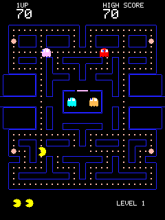

The arcade's 28x31-tile maze with all 244 dots and four energizers. Touch and hold beside, above or below Pac-Man to steer; he turns at the next junction where it fits. The ghosts follow the arcade's targeting rules (Blinky chases, Pinky ambushes, Inky mirrors, Clyde wanders) with scatter and chase phases. Three lives.

```bash
./mvnw -f juno-examples/pom.xml compile juno:upload \
  -Djuno.main=io.github.jabrena.juno.api.tft.PacMan
```

### Space Invaders

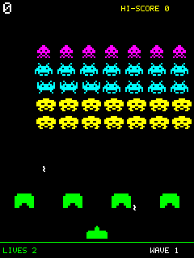

Touch and hold anywhere: the laser cannon slides towards your finger and fires whenever its shot is ready. The formation ripples and speeds up as it thins out, the shields crumble, and a mystery ship crosses the top now and then. Three lives.

```bash
./mvnw -f juno-examples/pom.xml compile juno:upload \
  -Djuno.main=io.github.jabrena.juno.api.tft.SpaceInvaders
```

### Tetris

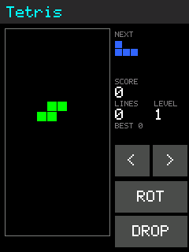

A 10x20 well with the seven tetrominoes, a next-piece preview, score, lines and levels. `<` and `>` move (and repeat while held), `ROT` rotates (so does tapping the well) and `DROP` drops the piece.

```bash
./mvnw -f juno-examples/pom.xml compile juno:upload \
  -Djuno.main=io.github.jabrena.juno.api.tft.Tetris
```

### Snake

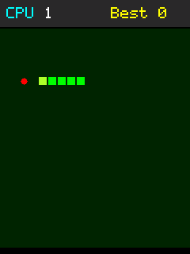

The CPU plays by itself (a breadth-first search to the food, checked with a flood fill) until you tap the header to take over. Then tap above/below or left/right of the head to turn; every bite makes the snake longer and faster.

```bash
./mvnw -f juno-examples/pom.xml compile juno:upload \
  -Djuno.main=io.github.jabrena.juno.api.tft.Snake
```

### Pong

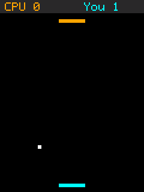

You against the computer. Your paddle at the bottom follows your finger; where the ball meets a paddle sets its angle, and each hit speeds it up. First to 7 wins.

```bash
./mvnw -f juno-examples/pom.xml compile juno:upload \
  -Djuno.main=io.github.jabrena.juno.api.tft.Pong
```

### Missile Command

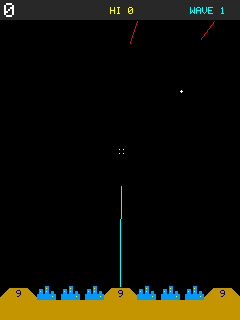

Warheads rain down on six cities and three bases; tap the sky to launch an interceptor that detonates where you tapped. Fireballs chain-react, and from wave 2 some warheads split halfway down.

```bash
./mvnw -f juno-examples/pom.xml compile juno:upload \
  -Djuno.main=io.github.jabrena.juno.api.tft.MissileCommand
```

### Tempest

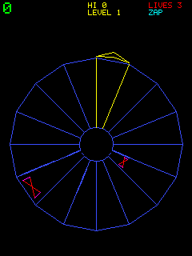

A vector-style tube seen end-on. Touch near the rim to move your claw around it (it fires while you hold), and tap the center for the once-per-level Superzapper. The tube changes shape every level.

```bash
./mvnw -f juno-examples/pom.xml compile juno:upload \
  -Djuno.main=io.github.jabrena.juno.api.tft.Tempest
```

### Lunar Lander

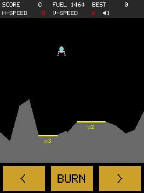

Hold `<`/`>` to rotate and `BURN` to thrust. Land upright and slowly with both feet on a yellow pad to score 50 times its multiplier (x2, x3, x5). Crashes cost fuel, and the game ends when the fuel runs out.

```bash
./mvnw -f juno-examples/pom.xml compile juno:upload \
  -Djuno.main=io.github.jabrena.juno.api.tft.LunarLander
```

### Whac-A-Mole

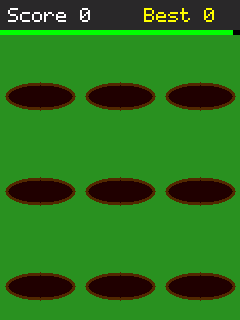

Moles pop out of nine holes; tap them before they duck. Golden moles are worth more and hide faster, and tapping a bomb costs points. Rounds get busier as the timer bar shrinks.

```bash
./mvnw -f juno-examples/pom.xml compile juno:upload \
  -Djuno.main=io.github.jabrena.juno.api.tft.WhacAMole
```

### Simon

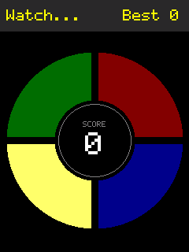

The classic memory toy: four colored pads light up in a growing sequence that you repeat by tapping them. Each round adds a step and plays a little faster. Tap the hub to start.

```bash
./mvnw -f juno-examples/pom.xml compile juno:upload \
  -Djuno.main=io.github.jabrena.juno.api.tft.Simon
```

## Board and strategy

Turn-based games against a computer opponent that searches ahead.

### Chess

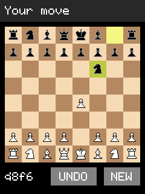

You play White against a 3-ply engine. Tap a piece to see its legal moves, then a destination; `UNDO` takes back a move pair and `NEW` starts over. Castling, en passant, promotion, check, checkmate and stalemate are all handled.

```bash
./mvnw -f juno-examples/pom.xml compile juno:upload \
  -Djuno.main=io.github.jabrena.juno.api.tft.Chess
```

### Checkers

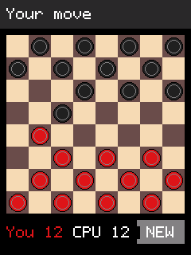

English draughts: captures are mandatory and multi-jumps continue with the same piece (tap each landing square). The computer runs a 5-ply alpha-beta search.

```bash
./mvnw -f juno-examples/pom.xml compile juno:upload \
  -Djuno.main=io.github.jabrena.juno.api.tft.Checkers
```

### Othello

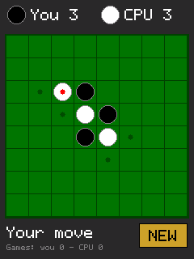

You play black; legal squares show a small dot, and the computer's last move a red one. The computer deepens its search for up to two seconds a move and plays the endgame out perfectly.

```bash
./mvnw -f juno-examples/pom.xml compile juno:upload \
  -Djuno.main=io.github.jabrena.juno.api.tft.Othello
```

### Connect Four

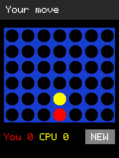

Tap a column to drop a red disc; the computer answers with a 4-ply search that prefers central columns. The loser moves first in the next game.

```bash
./mvnw -f juno-examples/pom.xml compile juno:upload \
  -Djuno.main=io.github.jabrena.juno.api.tft.ConnectFour
```

### Tic-Tac-Toe

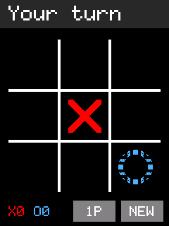

The "vanishing" variant: each player keeps at most three marks, so placing a fourth removes the oldest (drawn dimmed) and there are no draws. `1P` switches to two players.

```bash
./mvnw -f juno-examples/pom.xml compile juno:upload \
  -Djuno.main=io.github.jabrena.juno.api.tft.TicTacToe
```

### Backgammon

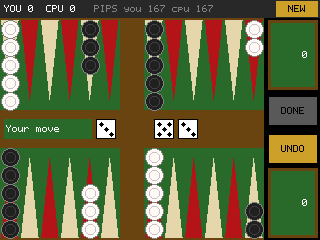

In landscape. `ROLL`, then tap a checker and one of the yellow rings that mark where it may go; tap your tray to bear off. `UNDO` takes back the turn, `DONE` ends it. Full rules, with gammons and backgammons scored; no doubling cube.

```bash
./mvnw -f juno-examples/pom.xml compile juno:upload \
  -Djuno.main=io.github.jabrena.juno.api.tft.Backgammon
```

### Mancala

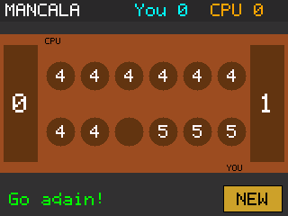

Kalah with six pits and four seeds, in landscape. Tap one of your pits (bottom row) to sow; a last seed in your store earns another turn, and one in an empty pit of yours captures the pit opposite.

```bash
./mvnw -f juno-examples/pom.xml compile juno:upload \
  -Djuno.main=io.github.jabrena.juno.api.tft.Mancala
```

### Battleship

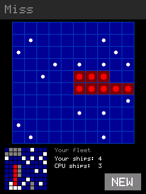

Random fleets on 10x10 grids. Tap the large enemy grid to fire; your fleet and the computer's shots show in the small grid below. The computer hunts on a checkerboard and follows lines of hits.

```bash
./mvnw -f juno-examples/pom.xml compile juno:upload \
  -Djuno.main=io.github.jabrena.juno.api.tft.Battleship
```

## Puzzles and simulations

Games you play against the board itself.

### Minesweeper

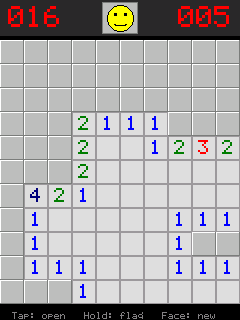

A 10x11 field with 16 mines. Tap to open (the first tap is always safe), press and hold to flag, tap a satisfied number to open its neighbours, and tap the face for a new game.

```bash
./mvnw -f juno-examples/pom.xml compile juno:upload \
  -Djuno.main=io.github.jabrena.juno.api.tft.Minesweeper
```

### 2048

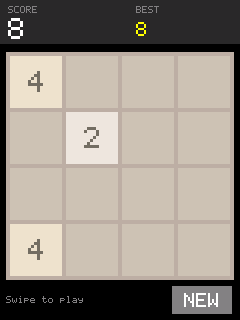

Swipe (or tap near an edge) to slide the tiles; equal tiles merge into their sum. Reach 2048 to win, and keep going.

```bash
./mvnw -f juno-examples/pom.xml compile juno:upload \
  -Djuno.main=io.github.jabrena.juno.api.tft.Game2048
```

### Game of Life

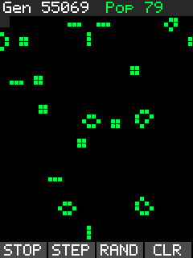

Conway's cellular automaton on a 40x46 wrapping grid. `RUN`/`STOP`, `STEP`, `RAND` and `CLR` control it; while stopped, drag on the grid to draw cells.

```bash
./mvnw -f juno-examples/pom.xml compile juno:upload \
  -Djuno.main=io.github.jabrena.juno.api.tft.GameOfLife
```

## Cards and casino

Card games and games of chance, played for chips or credits only.

### Blackjack

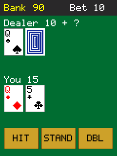

Set your bet with `-`/`+` and `DEAL`, then `HIT`, `STAND` or `DBL` (double down). The dealer stands on all 17s and blackjack pays 3:2. You start with 100 chips.

```bash
./mvnw -f juno-examples/pom.xml compile juno:upload \
  -Djuno.main=io.github.jabrena.juno.api.tft.Blackjack
```

### Texas Hold'em

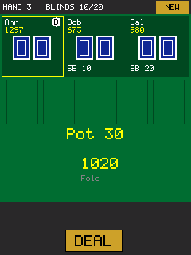

No-limit Hold'em against three computer players (Ann plays tight, Bob loose, Cal aggressive), 1000 chips each, with blinds doubling every eight hands. `FOLD`, `CHECK`/`CALL`, or set an amount with `-`/`+`/`ALL` and `BET`/`RAISE`. Side pots are handled. The computer players estimate their chances by dealing out the unknown cards at random.

```bash
./mvnw -f juno-examples/pom.xml compile juno:upload \
  -Djuno.main=io.github.jabrena.juno.api.tft.TexasHoldem
```

### Solitaire

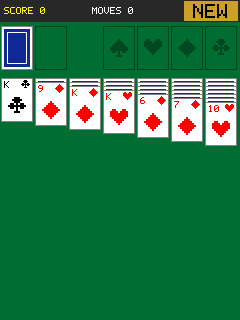

Klondike, draw one. Tap a card to pick it up (with everything on top of it), then tap where it should go; tapping a picked-up card again sends it to its foundation. Once every card is face up, the rest plays itself.

```bash
./mvnw -f juno-examples/pom.xml compile juno:upload \
  -Djuno.main=io.github.jabrena.juno.api.tft.Solitaire
```

### Slot machine

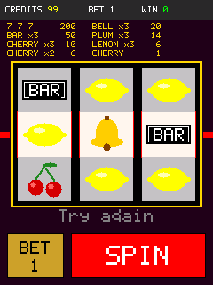

A three-reel machine with 7s, BARs, bells, plums, lemons and cherries. `BET` stakes 1 to 3 credits and `SPIN` pulls; the center row pays. The reels are weighted like a real machine for a long-run payback of 89.6%.

```bash
./mvnw -f juno-examples/pom.xml compile juno:upload \
  -Djuno.main=io.github.jabrena.juno.api.tft.SlotMachine
```

## Dice and chance

Short games of luck, nerve and prediction.

### Yahtzee

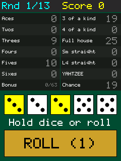

Solitaire Yahtzee over 13 rounds. `ROLL` up to three times, tapping dice to hold them, then tap a scorecard box (it previews what the dice would score). Includes the upper bonus, Yahtzee bonuses and the joker rules.

```bash
./mvnw -f juno-examples/pom.xml compile juno:upload \
  -Djuno.main=io.github.jabrena.juno.api.tft.Yahtzee
```

### Rock, Paper, Scissors, Lizard, Spock

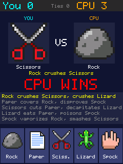

Tap one of the five pixel-art buttons. Each move beats two others and loses to two ("Spock vaporizes Rock"); the deciding rule lights up. The computer learns which move you tend to play next and counters it.

```bash
./mvnw -f juno-examples/pom.xml compile juno:upload \
  -Djuno.main=io.github.jabrena.juno.api.tft.RockPaperScissorsLizardSpock
```

### Russian roulette

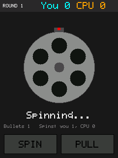

A cartoon duel with a six-chamber cylinder and no gore: `LOAD` 1 to 3 bullets, `START`, then take turns to `PULL`. Each player may `SPIN` the cylinder once per round, and chambers known to be empty are crossed out.

```bash
./mvnw -f juno-examples/pom.xml compile juno:upload \
  -Djuno.main=io.github.jabrena.juno.api.tft.RussianRoulette
```

## Demos

### Touch paint

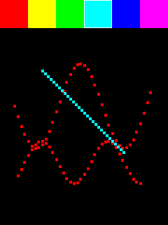

Not a game: pick a color along the top and finger-paint on the rest of the screen. Every touch is logged to Serial with its raw readings, which helps when calibrating a panel.

```bash
./mvnw -f juno-examples/pom.xml compile juno:upload \
  -Djuno.main=io.github.jabrena.juno.api.tft.TftTouchPaint
```

## Testing without the board

`./mvnw test` plays every game on an emulated shield, on any machine and in CI. The tests in
`juno-examples/src/test/java` replace the handful of `native` hardware classes with plain Java test
doubles, which come first on the test classpath (the `juno:compile`/`juno:upload` goals still use
the real ones):

- `Gpio` decodes the ILI9341 bus that the real `TftTouchShield` driver bit-bangs into a
  framebuffer, and answers the touch panel's analog reads, so tests can tap the screen.
- `Clock` and `Delay` run on simulated time: waiting is instant and each clock reading costs a
  millisecond, so frame loops and time-budgeted searches behave the same on every run.
- `Random` is a seeded `java.util.Random`, and `Serial` discards its output.

On top of these:

- `GameScreenshotTest` plays each game for a few simulated seconds with scripted taps and compares
  the screen with its picture in [`docs/images/games`](images/games). A mismatch writes the actual
  screen and a diff to `juno-examples/target/screenshots`. After an intended visual change,
  regenerate the pictures with
  `./mvnw -pl juno-examples test -Dtest=GameScreenshotTest -Djuno.updateScreenshots=true`.
- `CardGamesTest`, `BoardGamesTest` and `ChanceGamesTest` check rules and computer players: the
  poker hand ranking against a brute-force reference, no chip lost across all-ins and side pots,
  the slot machine's exact payback, Othello's perft counts, Backgammon and Mancala rules, and that
  each computer opponent beats a simple player.

This runs the games' Java on the JVM, not the code Juno generates for the board.

## Compiling with the real Arduino toolchain in Docker

`ArduinoCliCompileTest` does what `juno:verify` does for every game — Juno generates the sketch,
then `arduino-cli compile --fqbn arduino:renesas_uno:unor4wifi` builds and links it with the real
UNO R4 core — inside a Docker container started with [Testcontainers](https://testcontainers.com),
so you need Docker but no local Arduino installation. It fails if a game stops compiling or no
longer fits the board's flash or RAM, and prints each game's usage. It is opt-in:

```bash
./mvnw install -DskipTests
./mvnw -f juno-examples/pom.xml -Parduino-cli test
```

The first run builds the image from
[`juno-examples/src/test/docker/arduino-cli/Dockerfile`](../juno-examples/src/test/docker/arduino-cli/Dockerfile)
(`arduino-cli` plus the `arduino:renesas_uno` core, several hundred MB) and Docker caches it for
later runs. To use an image you built or pulled yourself, add
`-Djuno.arduinoCliImage=<image>`. Without Docker the test is skipped. If your network blocks
Docker Hub, also set `TESTCONTAINERS_RYUK_DISABLED=true`, since Testcontainers otherwise pulls its
cleanup container from there.

What neither test covers is the program running on the chip itself: timing, touch feel and the
panel's real colors still need the board and `juno:upload`.
